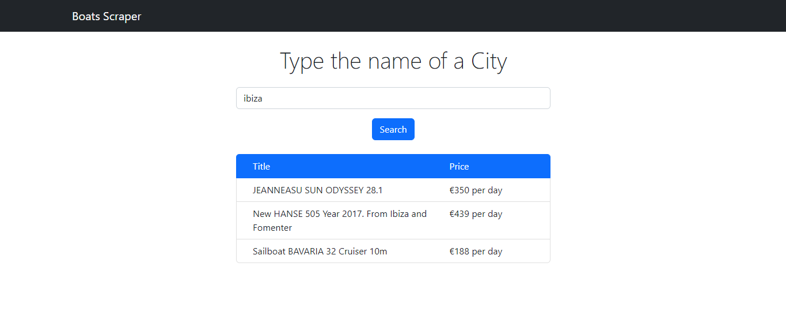

# scrapping-test

## Step 1 - generate projects
1. (front) You must generate a reactjs project 
2. (back) You must generate a server in python 

## Step 2 - Front : ReactJS
- On your ReactJS platform, the user must be able to enter the name of a city (eg: Ibiza) in a TextField
- Then create a button "Send" which will call a route in the backend 
- When the processing is done, the user must be able to see the name of the title and price of each boat

## Step 3 - Back : Python (flask or django)
- Create a route which will scrap the content of the first 3 pages of the website https://www.clickandboat.com/en/boat-rental/search?where={city}&DateDebut=2023-02-15&DateFin=2023-02-17&ProduitTypeId=Sailboat where {city} is the city entered by the user
- The content returned to the front is the name of the title and price of each boat

## Step 4 - GitHub
- Push the code in this GitHub repository

So far, the result of the front end application is the following

## Step 5 - Optional

To develop this step I planned to create a key attribute with the link to the single boat, on each element of the list (it's common with React components).
The click on the row will execute a re-scraping of the elements on the boat page through a useEffect function.

- Display to the user also the boat's Equipment which is located in the page when you click on the boat's card
- For example : https://www.clickandboat.com/en/boat-rental/ibiza/catamaran/aventura-37-vq2d22b should contain : Watermaker, Air Conditioning, Outboard, Fridge, Microwave, Generator

## Notes
- Take as much time as you need 
- Please comment the code :) 
- Don't forget to name the variables clearly 
